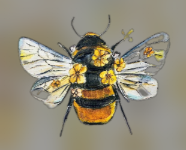

# Presentación del Proyecto
**Autor:** 
## Descripción
Este es el repositorio para la Tarea 1 del curso. El objetivo es demostrar el flujo de trabajo básico con Git y GitHub.
## Pasos Realizados
1. Creación del repositorio local.
2. Creación de este archivo `presentacion.md`.
3. Conexión con GitHub.

---

## Información personal
- **Nombre:** Mariana Molina
- **Carrera:** Diseno de la Comunicacion Produccion Audiovisual
- **Ocupacion:** Estudiante

---

## Sobre mi
Soy estudiante de doble carrera, me gusta dibujar y jugar video juegos, aprender cosas nuevas, hacer proyectos multi media
se hablar 3 idiomas (español, portugues e ingles) y soy super dedicada con lo que me proponga.

---

## Preferencias

| Gustos               | Disgustos                       |
|----------------------|---------------------------------|
| Dibujar              | Las matematicas                 |
| jugar video juegos   | Espacios muy ruidosos           |
| Escuchar musica      | Que me ignoren                  |
| Scouts               | Estar sin plata                 |

---

## Tareas

- [x] Crear Archivo Markdown para POO
- [x] Test de personalidades para Proyecto de Diseño Estrategico
- [ ] Llenar formulario de Proyecto de Diseño Estrategico
- [ ] Terminar Analisis De Sonido Interactivo
- [ ] Crear una historia para Narratologia
- [ ] Conseguir materiales para hacer stop motion en  Animacion 2D

---

